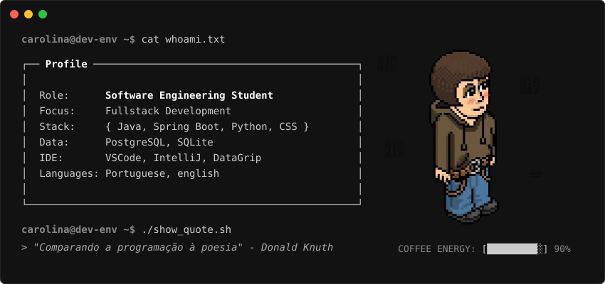

  _+SYSTEM_BOOTING...;>_+STARTING_CAROLINA.SH;>_+LOADING_BACKEND_MODULES..." alt="Typing Animation">
   
  
  

  

_+ls+-l+./projects;>_+PROJETOS_DE_DESTAQUE.MD" alt="Projects Header">

`>_` **[PomodoroFX](https://github.com/CarolinaaCabral/PomodoroFX)** — Aplicação desktop para gestão de tempo baseada na técnica Pomodoro. Desenvolvida em **Java** com **JavaFX**, a interface foi estruturada no padrão MVC utilizando ficheiros `.fxml` e estilização via **CSS**. O projeto aplica processamento assíncrono para garantir a atualização em tempo real dos ciclos de foco e pausa.

`>_` **[DevFit](https://github.com/muliroZ/DevFit)** — API REST para gestão de academias construída com **Java** e **Spring Boot**. Arquitetura conteinerizada com **Docker**, utilizando DTOs para transferência segura de dados e controladores organizados.

 

_+ping+-c+3+carolina;>_+ESTABELECER_CONEXAO.SH" alt="Contact Header">

`[ in ]` **[LinkedIn](https://www.linkedin.com/in/carolinaacabral)** — /in/carolinaacabral  
`[ ig ]` **[Instagram](https://www.instagram.com/carolinaa.dev/)** — @carolinaa.dev  
`[ @  ]` **[E-mail](mailto:carolinacabral@outlook.com.br)** — carolinacabral@outlook.com.br
